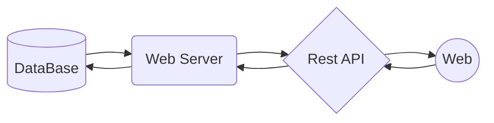

# SPG-API 

## 📋 Table of Contents

1. 🚀 [What is this API ?](#what-is-this-api)
2. ✨ [Swagger Documentation](#swagger-documentation)
3. ✅ [Installation](#installation)
4. 🔨 [Build](#build)
5. 💯 [Tests](#tests)
6. ❤️ [Contributors](#contributors)

## <a name="what-is-this-api">🚀  What is this API ?</a>

**Spg-api** is an api developed to perform as the primary backend structure for the SPG TCC project.

### Rest Architecture 

## <a name="swagger-documentation">✨ Swagger Documentation</a>

All endpoints, schemas and object constructors necessary to use this api properly can be found in the 
swagger platform by running the application locally and accessing: 

<a href="http://localhost:5144/swagger/index.html">http://localhost:5144/swagger/index.html</a>

## <a name="installation">✅ Installation</a>

Write about installations

## <a name="build">🔨 Build</a>

Write about Building

## <a name="tests"> 💯 Tests</a>

Write about Tests

## <a name="contributors">❤️ Contributors</a>
- <a href="https://github.com/andrepcarraro">Andre Carraro</a>
- <a href="https://github.com/Wegxx">Giovanna Nascimento Reis</a>
- <a href="https://github.com/MateusAbu">Mateus Abu Kamel</a>
- <a href="https://github.com/PierryLeal">Pierry Leal</a>